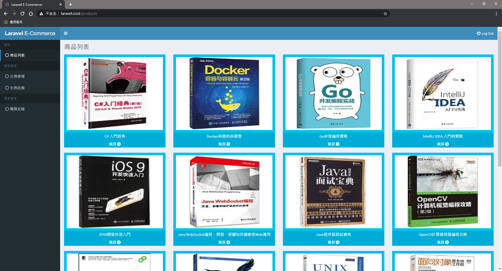

# laravel test

## 執行環境
* laradock

## 開發環境
* php 7.2+
* laravel 5.1+ ~ 5.9

## 使用
需先修改 /laradock/nginx/sites 內的 conf
* \> `docker-compose restart nginx`

之後進 workspace
* \> `docker-compose exec workspace`
* \> `git clone git@github.com:fizz0113/laravel-test.git`
* \> `composer install`
* \> `cp .env.example .env`
* * 修改 .env 內容
* \> `php artisan migrate && php artisan db:seed`

開啟瀏覽器 執行 <http://your_host>

## 展示

